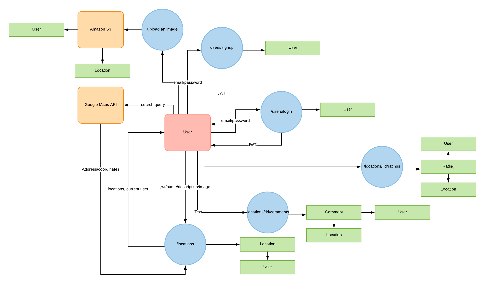
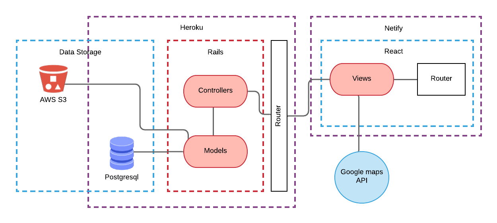
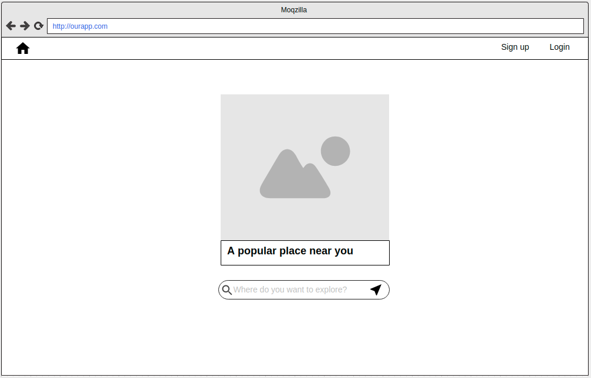
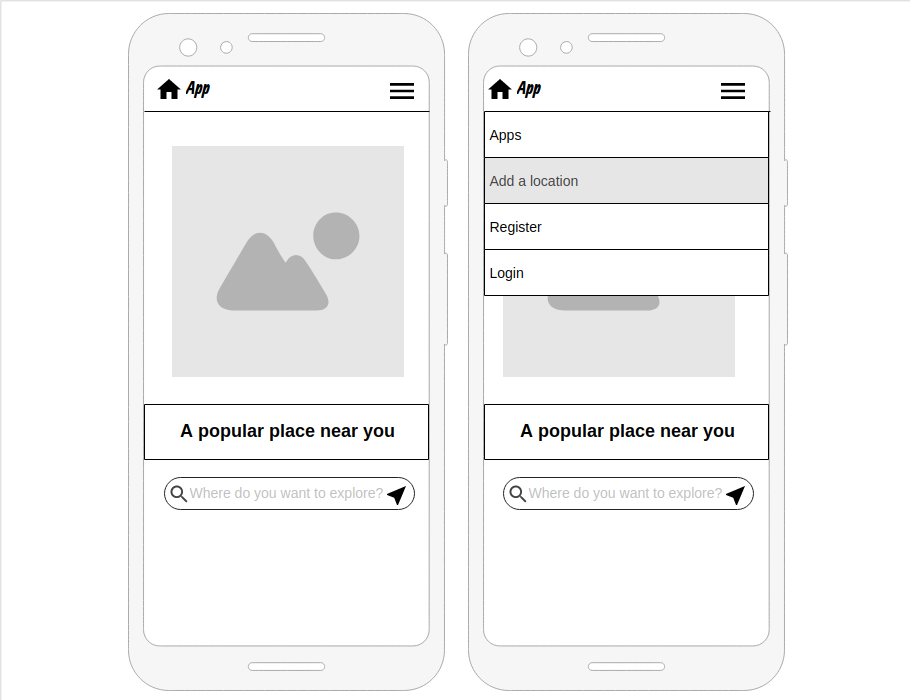
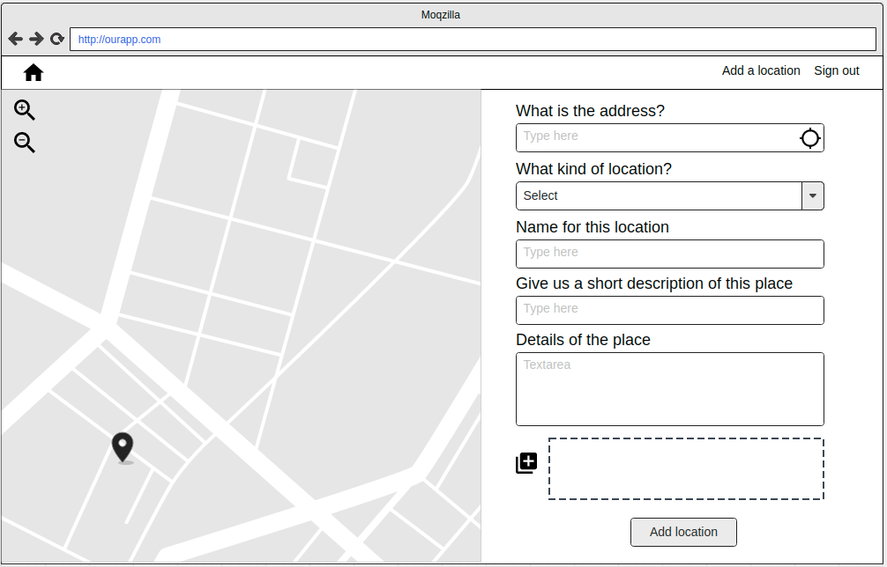

## Purpose
---
Hidden Gems is an application for mapping and exploring interesting places. It aims to create an interactive, easy to use database of interesting, unique and free places to explore, which are created by the users. Places could include historical landmarks, photography locations, street art, natural wonders or any place of interest that is free and publicly accessible.

Hidden Gems is different from other travel/activity finder apps is that it is purely focused on showing free, outdoor places of interest rather than commercial establishments, and tourist attractions, and it aims to utilise the knowledge of users to uncover lesser known unique and interesting places.

We are aiming to serve a community of people who are looking to explore, travel and share their favorite places with anyone who wants to discover them.

## Functionality / Features
---
User Authentication

Interactive Map
- The main page of the app will include an interactive map
- A search bar, allowing users to search places by location
- Search filters so users can search by category or rating
- Clickable markers for each place on the map

Show Page
- Each location will have it's own page that shows details about the location, comments and an image gallery

Create, Edit and Delete locations
- Users are able to create, edit and delete locations
- Users can pin the location they want to add on a map, using a draggable marker
- Users can edit and delete the locations that they have created
- Admin users can delete any location

Image Uploads
- Users upload an image when they create a location
- Users can upload images to any location which will be displayed in it's image gallery

Comments
- Users can leave comments on each location

Rating
- Users can rate a location

## Target audience
---
Due to the flexibility in terms of the types of locations that can be added to the application, this app will serve many different users with many different interests.

There is the potential to evolve with the users who upload locations and interact with the app, as popular locations are prioritised in search results and different categories can be added to meet user demand.

Initially, we will focus on a few different interest groups that we believe will benefit from using this app.

**Tourists/Travellers**
This app could be a useful tool for tourists to easily find interesting sights and places of interest, wherever they are travelling

**Creative Types**
This could include artists, arts and architecture enthusiasts who want to explore art around the city

**Photographers/Photography Enthusiasts**
Photographers can use the app to find locations that are good for photography, while utilising the locations image gallery to get an idea of the types of photos that can be taken

## Tech stack
---
- Ruby on Rails
- React
- Postgresql
- AWS S3 Buckets
- Git/Github

## User Stories
---
***Meghan is a photography student who is completing a project on architectural photography.***

As a user, she will need to be able to sign up and log in to the site so that she can save and view locations later. 

She also wants to search for locations in her city where she can take interesting photographs for her project. Before deciding where to go, she would like to view photos uploaded by other users in different locations in order to make a decision.

***Tim is taking a year off uni to travel around the world. He is travelling on a budget and is always looking for free and interesting places to explore, wherever he travels.***

As a user, Tim wants to see all the interesting locations on the map which is near where he stays, and easily click on locations to decide what places to visit.

As a contributor, Tim would also like to leave comments and ratings about the places he visited, to help fellow travellers find the best places to visit.

***Todd is an enthusiast for street art. He wants a way to share the locations of interesting street art in his city, so that other people can more easily find and appreciate it.***

As a user, he wants to be able to pin-point locations of good street art on a map and add them so that other people can easily find them, without having to know their address. 

Todd recently received a comment on one of his locations explaining that the address was incorrect. As a user, he wants to be able to edit the location to correct the error.

***Candace is a travel blogger and social media influencer who is looking for ways to gain more exposure.***

As a contributor, she wants to be able to upload photos to locations on the app, by linking her instagram account to the app, in order to direct potential followers to her profile.

***Tess is an admin for Hidden Gems.***

She has noticed that sometimes people add locations that are spam, advertisements or just irrelevant to the site. She needs to be able to delete these locations so that they don't clog the site and make it harder for users to find what they are looking for. She also needs to be able to delete comments on locations for the same reasons.

I initially was going to have one user story for each target audience, but then I realised this alone did not cover all the features of the application. I made sure to include user stories that referred to features such as adding a location and uploading photos to a location and then later added the admin user to explain cases where locations might need to be deleted.

## Dataflow Diagram
---

## Application Architecture Diagram
---

## Wireframes
---

Landing Page
---

Desktop

Mobile

Main Page
---

Desktop

Mobile

Add Location Page
---

Desktop

Mobile

Location Page
---

Desktop

Mobile

